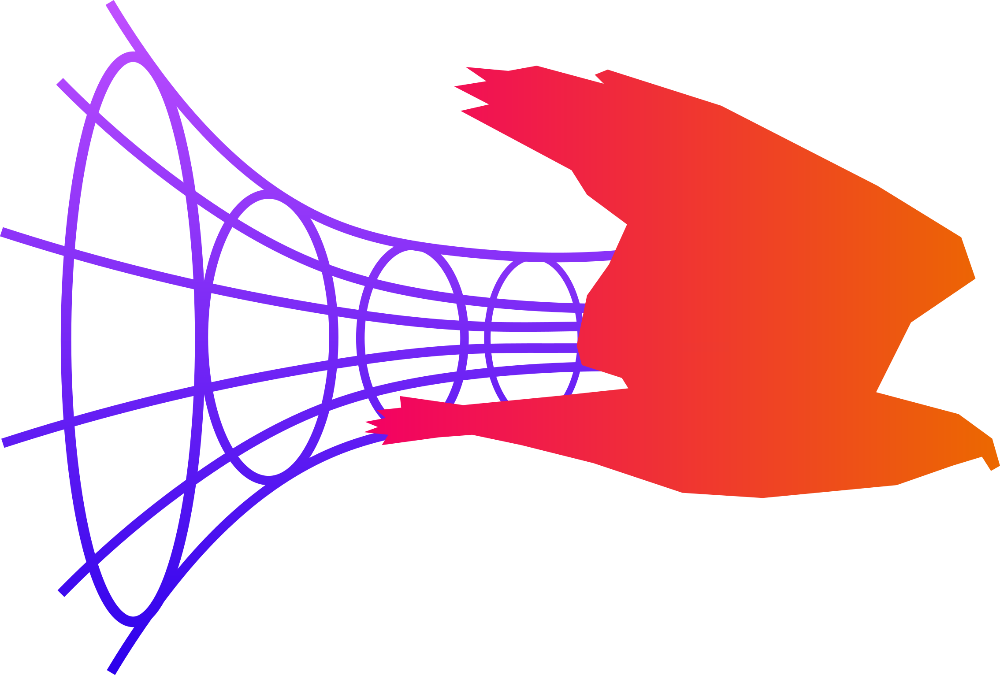

# Hawk

## A programming language for physicists

### Getting Started

Download the `hawk-lang` binary for your platform, or compile from source by running `cd app && cargo build --release`. If built from scratch, the binary can be found in `app/target/release`. Copy the downloaded or compiled binary to a folder that is in your PATH and make sure it works by running `hawk-lang`.

Create a `.hawk` file to write your code in and run it with `hawk-lang filename.hawk`, or use the shell by running `hawk-lang`. 

The syntax of the Hawk language can be found in [spec.md](docs/spec.md), and documentation of the standard library in [std.md](docs/std.md). 